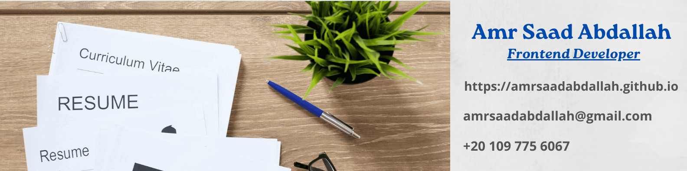
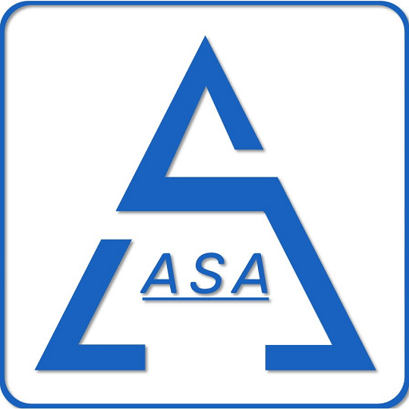

<h1 align="center">  AMR SAAD ABDALLAH RESUME 

---

<a href="https://github.com/amrsaadabdallah/resume/blob/main/Amr-Saad-Abdallah-Resume.pdf" target="_blank">

 DL Resume PDF &darr;

</a>

##### Greetings,

This is Amr Saad a Frontend developer seeking a job opportunity in a supportive and co-operative environment in Web Development field as a new challenge, where I can utilize my skills and knowledge efficiently for organizational growth and enable me taking significant contribution at the company that I will join and help me to achieve more progress and success.

I have a passion for programming and code, always looking for new tools and improve my skills through continuous self-learning and code a long, design responsive websites using HTML5, CSS3, Sass, Bootstrap, Tailwind CSS, JavaScript, ES6, and also JS frameworks like ReactJS.

I hold Bachelor of Communications Engineering of Fayoum University with Accumulative Grade Very Good with High Honors. And also holds a 9-Month Diploma from Information Technology Institute (ITI), Wireless Communications Track, Suez Canal Branch, Intake 35, and Ranked 1st of the track.

My studies in ITI enabled me to work under pressure, Ability to work as an effective team member and individual, the ability to adapt to changing work environments.

I worked more than three years in RF field at Red Telecom company in Huawei Multi-Vendor Project but I decided to search about a new challenge in a new field as the RF didn't fill my passion I choose “web development” field to be the new challenge. So, I started to invest in myself by taking a frontend diploma at route academy and take training at Eraasoft academy and continuous self-learning from YouTube Tutorials & Udemy courses.

Plus, I experience of more than 3 years in voluntary work as a Volunteer in “LIFE MAKERS” Organization from 2011, which provided me with how to deal with people and take responsibility and people management and distribution of tasks.

I joined the Egyptian army and my service period given me patience and bear responsibility, order and discipline and how to deal with top-level.

I am aware that you will receive a large number of applications for this job, but I would very much appreciate the opportunity to demonstrate my capabilities to you and I believe that I have a lot to offer your organization as I am keen to develop my professional skills and ready to give all of my potential effort to make the work a success and open to learning new technologies and techniques with pleasure. Willing to do my best to develop my skills and succeed and look forward to discussing my application with you at an interview.

I have enclosed a copy of my resume for your consideration and looking forward to speak with you about this employment opportunity, I can be contacted at all times on the details provided below,

Thank you for your time and consideration.

Sincerely,
[Amr Saad Abdallah](https://amrsaadabdallah.github.io)

---
### 👋 Get In Touch:

- [🌐 Website 👉 https://amrsaadabdallah.github.io](https://amrsaadabdallah.github.io)
- [👔 LinkedIn 👉 https://www.linkedin.com/in/amrsaadabdallah](https://www.linkedin.com/in/amrsaadabdallah)
- [🌟 Github 👉 https://github.com/amrsaadabdallah](https://github.com/amrsaadabdallah)
- [📧 Gmail 👉 amrsaadabdallah@gmail.com](mailto:amrsaadabdallah@gmail.com)
- [🐤 Twitter 👉 https://twitter.com/amrsaadabdallah](https://twitter.com/amrsaadabdallah)
- [:phone: Whatsapp 👉 (+20) 109-775-6067](https://api.whatsapp.com/send/?phone=%2B2001097756067&text&type=phone_number&app_absent=0)

---

<a target="_blank" href="https://amrsaadabdallah.github.io">

 2022 &copy; Amr Saad Abdallah 

</a>

